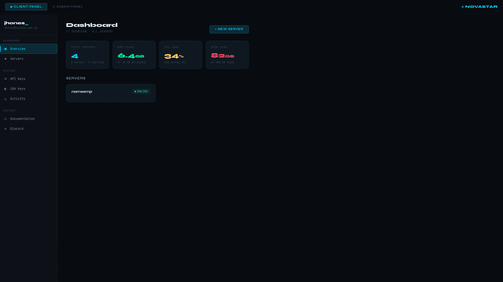

# 🌟 NovaStar — Pterodactyl Theme

> A **Dark Futuristic + Clean Minimal** theme for Pterodactyl Panel.  
> Cyberpunk-inspired aesthetics with sharp neon accents and a clean, pro layout.


---

## ✨ Features

- 🎨 **Dark Futuristic** design with `#00d2ff` cyan neon accents
- 🧹 **Clean & Minimal** — no visual clutter, everything is purposeful
- ✍️ **JetBrains Mono + Syne** font pairing for that dev-terminal aesthetic
- 📐 Covers **Client Panel** and **Admin Panel**
- 💡 Styled: nav, cards, buttons, forms, tables, modals, alerts, progress bars
- 🖱️ Custom slim scrollbar
- 📦 Single CSS file — easy to install

---

## 📸 Preview

| Client Panel | Admin Panel |
|---|---|
|  |  |

> Live preview: open `preview.html` in your browser

---

## 🚀 Installation

### Method 1 — Custom CSS Inject (Recommended)

> Works without modifying Pterodactyl's source code.

1. Copy the contents of [`src/novastar.css`](src/novastar.css)
2. Go to your Pterodactyl panel settings  
   → **Admin Panel** → **Settings** → **Custom CSS**
3. Paste the CSS and save

### Method 2 — Direct File Replace

> For self-hosted panels with server access.

```bash
# 1. Clone this repo
git clone https://github.com/YOUR_USERNAME/novastar-theme.git

# 2. Copy CSS to your Pterodactyl public folder
cp novastar-theme/src/novastar.css /var/www/pterodactyl/public/themes/novastar.css
```

Then reference it in your panel config or blade template:
```html
<link rel="stylesheet" href="/themes/novastar.css">
```

---

## 🎨 Customization

All colors are defined as CSS variables at the top of `novastar.css`. Easy to tweak:

```css
:root {
  --cyan:        #00d2ff;   /* Main accent color */
  --green:       #00ff9d;   /* Success / online status */
  --red:         #ff4466;   /* Danger / offline status */
  --yellow:      #ffd060;   /* Warning / starting status */
  --bg-base:     #080b10;   /* Page background */
  --bg-panel:    #0d1117;   /* Sidebar background */
  --bg-card:     #111820;   /* Card background */
}
```

Want a **purple** accent instead of cyan? Change `--cyan: #a855f7;` and you're done.

---

## 🗂️ File Structure

```
novastar-theme/
├── src/
│   └── novastar.css      ← Main theme file (inject this)
├── screenshots/
│   ├── preview.png
│   ├── client.png
│   └── admin.png
├── preview.html           ← Live design preview (open in browser)
└── README.md
```

---

## 🧪 Tested On

| Pterodactyl Version | Status |
|---|---|
| v1.11.x | ✅ Working |
| v1.10.x | ✅ Working |
| Pelican Panel | ⏳ Untested |

---

## 🤝 Contributing

PRs welcome! If you find styling bugs or want to add support for more panels:

1. Fork this repo
2. Create a branch: `git checkout -b fix/your-fix`
3. Commit: `git commit -m "fix: description"`
4. Push and open a Pull Request

---

## 📄 License

MIT License — free to use, modify, and distribute.  
Credit appreciated but not required. ⭐ Star the repo if you like it!

---

<div align="center">
  Made with 🩵 by <a href="https://github.com/YOUR_USERNAME">YOUR_USERNAME</a>
  <br><br>
  
  
  
</div>
